

<h1 style="padding:0px; margin:4px;">Baby Got Backend:</h1> 
<h2 style="padding-left:10px; margin:4px;"><em>To Server, Serverless or Headless CMS</em> 🧐 </h2>

<h3>What to Expect</h3>
<ul>
<li>Traditional on-prem servers</li>
<li>Cloud Hosting: DigitalOcean & AWS EC2</li>
<li>Serverless: Amazon Lambda, S3, API Gateway, etc</li>
<li>Command line deployment: Netlify, Zeit and Heroku:
     Deployment options for Node.js and Django</li>
<li>Firebase and Firestore in a Vue Application</li>
<li>Headless CMS: 
     Contentful (in Angular), Sanity, Netlify CMS and Prismic</li>
</ul>
<h2>Find this presentation: <em>github.com/micleners/baby-got-backend</em></h2>

    <h5>Brought to you by:</h5>
    
     
    <h5 style="margin-top:10px;"><em>Presentation by</em></h5>
    <h2 style="margin-top:4px; margin-left: 30px"><em style="color:#3D1A57"> Michael Leners</em></h2>
        <h2 style="color: #3D1A57; display:flex; flex-direction: row; align-items: baseline;"><em>@micleners</em>
        </h2>
        <h2 style="color: #3D1A57; display:flex; flex-direction: row; align-items: baseline;"><em>@micleners</em></h2>

# Goal of this Presentation: *Share and Inspire*

## Web Architecture Zoomed Out
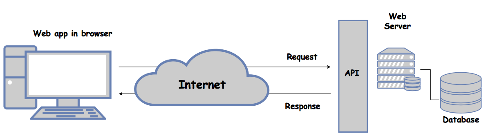

## Traditional Backend: On-Prem or Hosted Servers
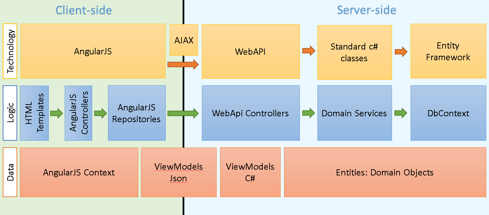

## Traditional Backend: On-Prem or Hosted Servers
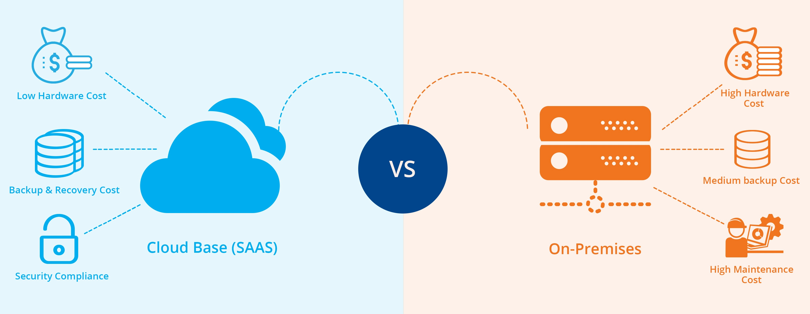

## Traditional Backend: On-Prem or Hosted Servers
 
TBH, my experience with server management has not been too stimulating. It's primarilly been cloud based and infrastructure as code. I've also heard it wasn't any better with on-prem 🤷‍♂️

Here are some pain points for on-prem:
- Must maintain solution and related processes (also true for cloud but in different ways)
- Responsible for server hardware, software, power consumption, and space
- Must employ people to manage on-prem servers
- Can't just upgrade to a bigger instance with a click/CLI command

There are some advantages: having control over data, potentially being able to implement better security solutions (yet somewhat doubtful for most companies), governmental compliance. Here's an article that does a nice [compare and contrast](https://www.cleo.com/blog/knowledge-base-on-premise-vs-cloud)

## The Emergence of Cloud Hosting - Dedicated Servers
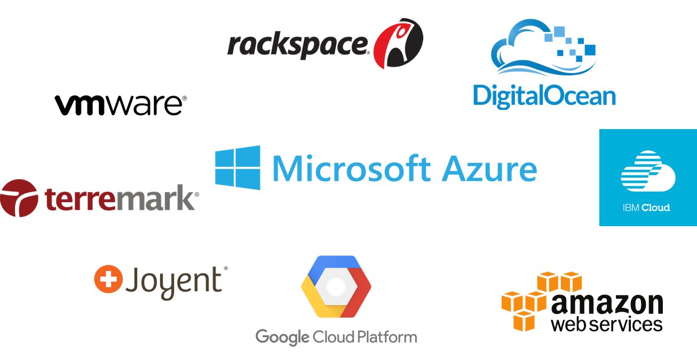

# Option 1: Put what was local, into the cloud
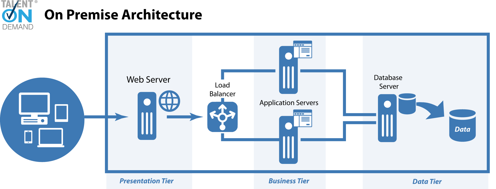
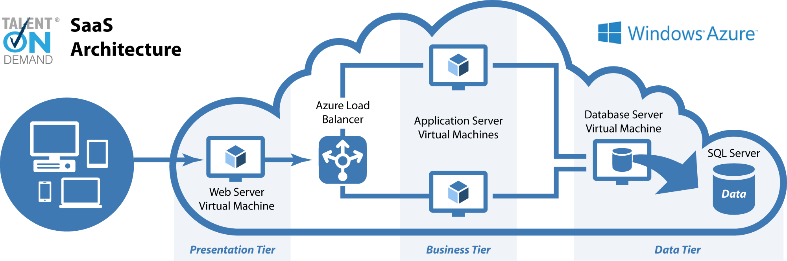

## Digital Ocean Servers
- [APS.NET Core](https://www.godo.dev/tutorials/aspnet-core-mysql-ubuntu-16-04/)
- [Django](https://www.digitalocean.com/community/tutorials/how-to-set-up-django-with-postgres-nginx-and-gunicorn-on-ubuntu-18-04)
- [Node.js](https://www.digitalocean.com/community/tutorials/how-to-set-up-a-node-js-application-for-production-on-ubuntu-18-04)

### General Process on Digital Ocean:
- Purchase $5 droplet (server)
- SSH onto your server
- Get your application set up through git
- Set up DB appropriately
- Set up appropriate server runner (Gunicorn for Django, Kestrel in APS.NET, PM2 for Node.js)
- Set up a reverse proxy with Nginx to route domain to app
- Profit

## AWS EC2:
- [APS.NET Core](https://docs.aws.amazon.com/elasticbeanstalk/latest/dg/dotnet-core-tutorial.html)
- [Django](https://docs.aws.amazon.com/elasticbeanstalk/latest/dg/create-deploy-python-django.html)
- [Node.js](https://docs.aws.amazon.com/elasticbeanstalk/latest/dg/create_deploy_nodejs.html)

## Other options from Azure, Google Cloud, etc

# Option 2: Serverless Break Up of Architecture

## Approach to Serverless
What is serverless, anyhow? I borrowed this definition from [this Medium Article](https://hackernoon.com/what-is-serverless-architecture-what-are-its-pros-and-cons-cc4b804022e9):

*"Serverless is a cloud computing execution model where the cloud provider dynamically manages the allocation and provisioning of servers. A serverless application runs in stateless compute containers that are event-triggered, ephemeral (may last for one invocation), and fully managed by the cloud provider. Pricing is based on the number of executions rather than pre-purchased compute capacity"*

### AWS Lambda
- [Django (pictured below)](https://blog.lawrencemcdaniel.com/serve-a-django-app-from-an-aws-lambda-function/)
- [ASP.NET Core](https://docs.aws.amazon.com/lambda/latest/dg/lambda-dotnet-coreclr-deployment-package.html)
- [Node.js with Express](https://dev.to/brightdevs/how-to-convert-an-express-app-to-aws-lambda--44gc)
- [Xilution Example for Serverless Node.js App](https://github.com/xilution/xilution-react-todomvc)
- [Another NodeJS (pictured below)](https://medium.com/the-node-js-collection/building-your-first-serverless-app-in-node-js-with-aws-lambda-s3-api-gateway-4d87e808d9cc)

## [Django AWS Serverless example](https://blog.lawrencemcdaniel.com/serve-a-django-app-from-an-aws-lambda-function/)
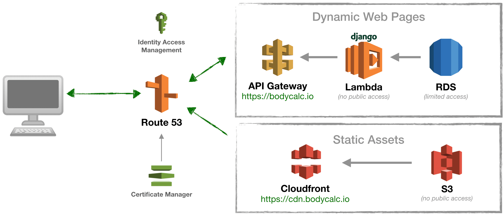

## [NodeJS Serverless example](https://medium.com/the-node-js-collection/building-your-first-serverless-app-in-node-js-with-aws-lambda-s3-api-gateway-4d87e808d9cc)
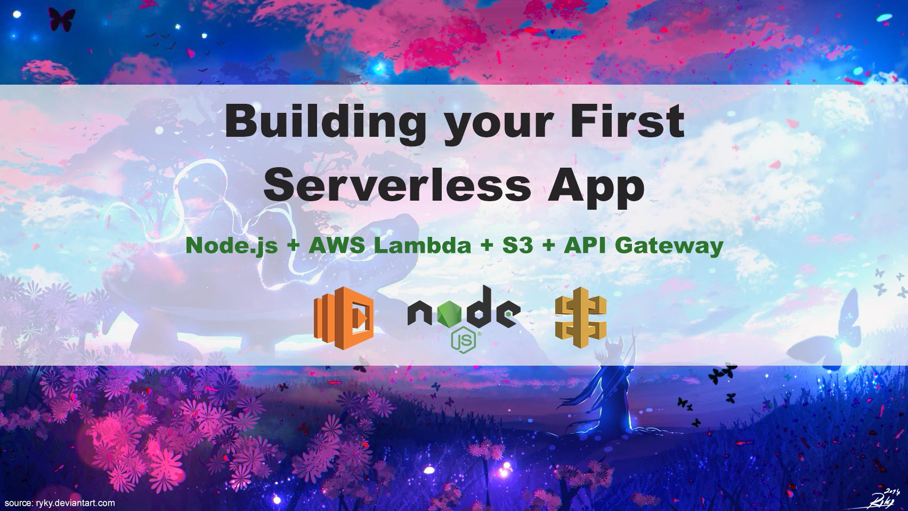

# Option 3: Firebase Serverless Model

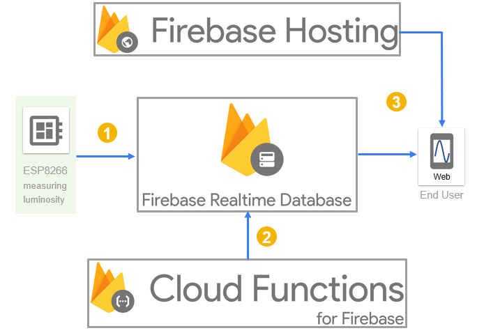

## Firebase 🔥
Firebase offers a comprehensive development platform for making mobile and web apps. It is a cloud solution provided by Google. It can be used with applications for authentication, analytics, storage, databases, and beyond. We'll look at Firestore.

### I started an app named [NomTime](https://github.com/micleners/nomtime) using these tutorials:
- [How to build an SPA using Vue.js, Vuex, Vuetify, and Firebase: use Vuex and access the API](https://www.freecodecamp.org/news/how-to-build-an-spa-using-vue-js-vuex-vuetify-and-firebase-use-vuex-and-access-the-api-f8036aa464ad/)
- [Working an application in Vue.js with TDD](https://medium.com/magnetis-backstage/working-an-application-in-vue-js-with-tdd-an-extensive-guide-for-people-who-have-time-part-1-3be791dafa2b)
- [A Vuex Tutorial by Example - Learn Vue State Management](https://coursetro.com/posts/code/144/A-Vuex-Tutorial-by-Example---Learn-Vue-State-Management)

## NomTime App Structure
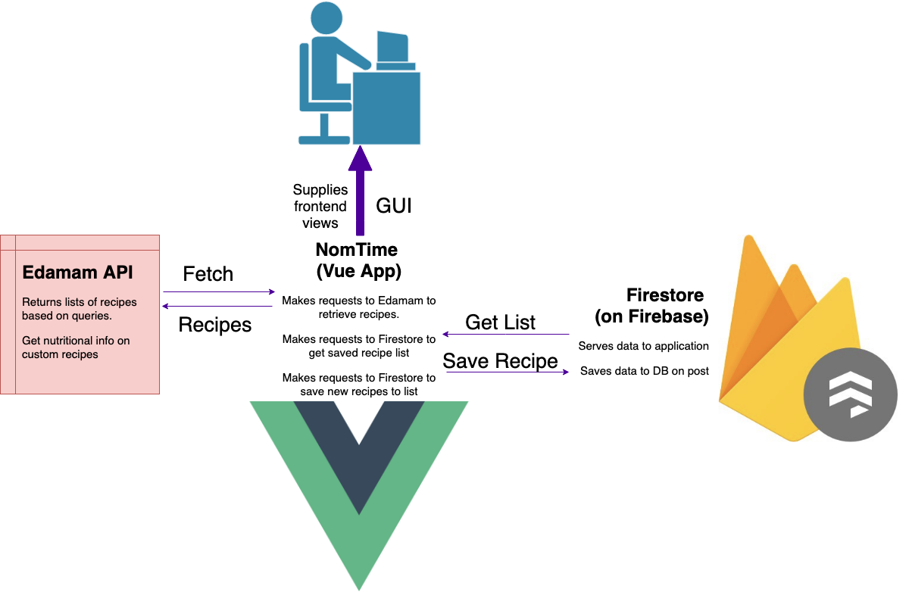

## Hooking up Firebase to Vue Application (similar in other frameworks):
- Install Firebase npm package
- Initiate Firebase (in `main.js` in Vue project)
- Set up db context (point to `firebase.firestore()`)
- Use the db to get, save, update, etc

### Additionally API/Functionality Management:
- I created an action call to get data from the Edamam API service (see first tutorial above)
- I created a button called `Load Recipes` that takes the search queary, makes a request to get the top 10 results, then stores the query result to the firestore DB
- Future goal was to have a more robust user interface and functionality. See [design mock ups in repo](https://github.com/micleners/nomtime)

# Option 4: Command Line Deployment

## Heroku my Hero 🥰
It makes deployment easy - Heroku takes a lot of the legwork out of the way. All possible from the command line!
Similar to [Netlify](https://www.netlify.com/) and [Zeit's Now.sh](https://zeit.co/now)

### Node.js Documentation on Heroku
[Heroku Tuturial for Node.js](https://devcenter.heroku.com/articles/getting-started-with-nodejs)

#### Personal Quest
[Twilio Quest](https://www.twilio.com/quest/u/mdevstix) while I was working on applying for a software education position with Twilio on the Twilio Quest team. Used Node.js and deployed on Heroku as found in my [Twilio Quest repo](https://github.com/micleners/twilioquest-sms).

### Note: No sanctioned ASP.NET solution on Heroku

### Django on Heroku
[Example for using Postgres with Django on Heroku](https://medium.com/@qazi/how-to-deploy-a-django-app-to-heroku-in-2018-the-easy-way-48a528d97f9c)
Deploying Django applications onto Heroku is similar to other applications:
- Place Procfile in root directory directing Gunicorn be used for deploying
- Make sure you have a requirements.txt, Pipfile or similar file declaring packages to install
- Include heroku-django settings and commands to help alleviate difficulties around static deploy
- Use Heroku CLI to push up to deploy.

Example of this can be found at the end of my [django workshop](https://github.com/micleners/django-workshop) & in the commit log

Example of running [django API endpoint](https://radiant-brushlands-99143.herokuapp.com/api)

# Option 5: A Headless CMS
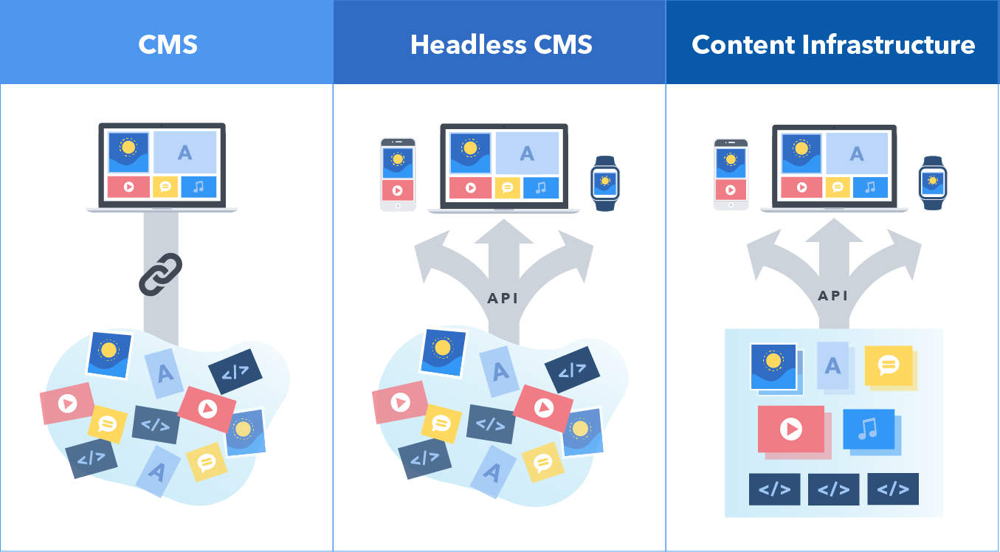

# Contentful
Beyond headless CMS, Contentful is the essential API-first content management infrastructure to create, manage and distribute content to any platform or device. 
[Easy start with GatsbyJS](https://www.contentful.com/r/knowledgebase/gatsbyjs-and-contentful-in-five-minutes/)

## Contentful and Angular
I've just begun to play around with this, but so far I'm loving Contentful. Here's what I've done:
- Used [this contenful tutorial](https://www.contentful.com/developers/docs/javascript/tutorials/using-contentful-in-an-angular-project/) to load up products in publicly available space
- Created my own space with events, users and locations models (similar to [Django Workshop](https://github.com/micleners/django-workshop) API I created).
- Swapped out the tutorial API code with my own, updated the data models and attributes. Data loaded nicely
- Code is available [in this repo](https://github.com/micleners/angular-contentful)

# Other Headless CMS Options:

- [SanityIO with Gatsby](https://www.sanity.io/blog/how-to-quickly-set-up-a-gatsby-js-jamstack-website-with-a-headless-cms)
- [SanityIO on Zeit Now](https://zeit.co/guides/deploying-sanity-studio-with-now)

- [Netlify CMS with NextJS](https://www.netlifycms.org/docs/nextjs/)
- [Netlify CMS with Gatsby](https://www.netlifycms.org/docs/gatsby/)
- [WordPress as a Headless CMS with Vanilla JS](https://www.sitepoint.com/wordpress-headless-cms/)
- [WordPress as a Headless CMS with Gatsby](https://www.gatsbyjs.org/blog/2018-01-22-getting-started-gatsby-and-wordpress/)
- [Prismic](https://prismic.io/)

    
# Questions, Comments or Remarks? 🧐

## All resources available at: 
<em>github.com/micleners/baby-got-backend</em>

- [This Presentation](https://github.com/micleners/baby-got-backend) (Angular-Contentful Project):
 - [Easy start with GatsbyJS](https://www.contentful.com/r/knowledgebase/gatsbyjs-and-contentful-in-five-minutes/)
 - [Angular tutorial](https://www.contentful.com/developers/docs/javascript/tutorials/using-contentful-in-an-angular-project/)
- [NomTime](https://github.com/micleners/nomtime) (Vue application with Firestore and Edamam API): 
 - [How to build an SPA using Vue.js, Vuex, Vuetify, and Firebase: use Vuex and access the API](https://www.freecodecamp.org/news/how-to-build-an-spa-using-vue-js-vuex-vuetify-and-firebase-use-vuex-and-access-the-api-f8036aa464ad/)
 - [Working an application in Vue.js with TDD](https://medium.com/magnetis-backstage/working-an-application-in-vue-js-with-tdd-an-extensive-guide-for-people-who-have-time-part-1-3be791dafa2b)
 - [A Vuex Tutorial by Example - Learn Vue State Management](https://coursetro.com/posts/code/144/A-Vuex-Tutorial-by-Example---Learn-Vue-State-Management)
- [Django REST API Workshop](https://github.com/micleners/django-workshop)
- [Full Stack with Ember and Django](https://github.com/micleners/DSM-Web-Geeks)
- Heroku, AWS EC2 vs Lambda, and Digital Ocean Links and Headless CMS links can be found in slides above

# 🙏 Thank you for coming and have a great rest of the conference!

    <h5>Brought to you by:</h5>
    
     
    <h5 style="margin-top:10px;"><em>Presentation by</em></h5>
    <h2 style="margin-top:4px; margin-left: 30px"><em style="color:#3D1A57"> Michael Leners</em></h2>
        <h2 style="color: #3D1A57; display:flex; flex-direction: row; align-items: baseline;"><em>@micleners</em>
        </h2>
        <h2 style="color: #3D1A57; display:flex; flex-direction: row; align-items: baseline;"><em>@micleners</em></h2>

