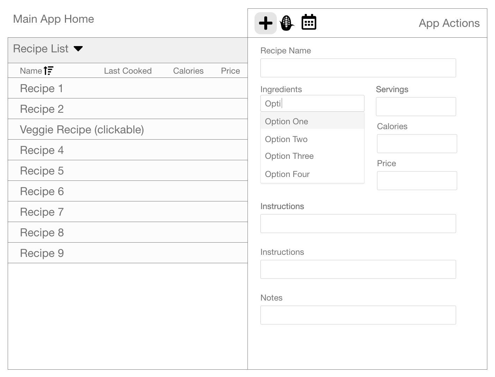
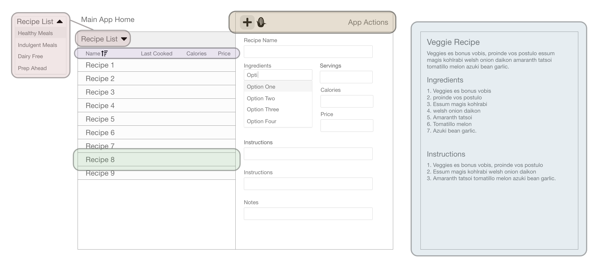
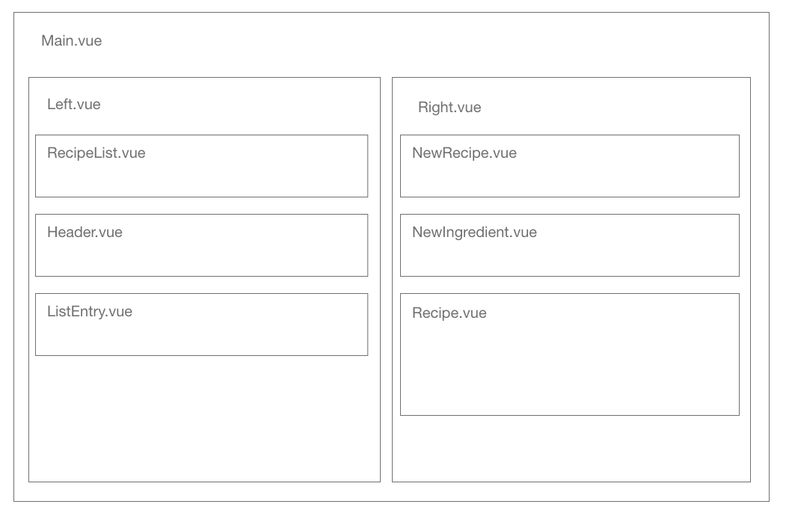
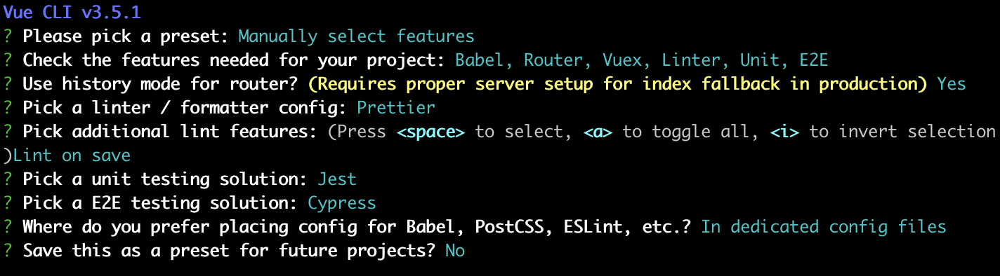

# nomtime

## Project setup

```
npm install
```

### Compiles and hot-reloads for development

```
npm run serve
```

### Compiles and minifies for production

```
npm run build
```

### Run your tests

```
npm run test
```

### Lints and fixes files

```
npm run lint
```

### Run your end-to-end tests

```
npm run test:e2e
```

### Run your unit tests

```
npm run test:unit
```

### Run and watch your unit tests

```
npm run test:unit:watch
```

### Customize configuration

See [Configuration Reference](https://cli.vuejs.org/config/).

## Original Specs

A basic recipe app that allows:

- Creating Recipes
- Input ingredients
- Input Nutritional Information
- Input shopping list
- Take notes on recipes
- Tracks date cooked
- Input info on cooking recommendations

## App Wireframe:

[View Wireframe Demo](https://xd.adobe.com/view/3b3622ef-cf7d-4ea1-7815-671a1be501e1-4d07/)

Mockup of App (screenshot from link above)


How I envision to break up components:


Initial stab at component naming:


## Original Setup

Setup: `vue create nomtime`
Setup options:


1. Render initial component: RecipeView
2. Make sure recipe list view renders with two additional components:
   a) ListRecipe
   b) NewRecipeForm
